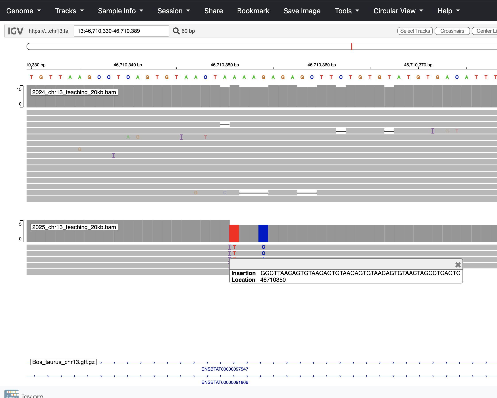
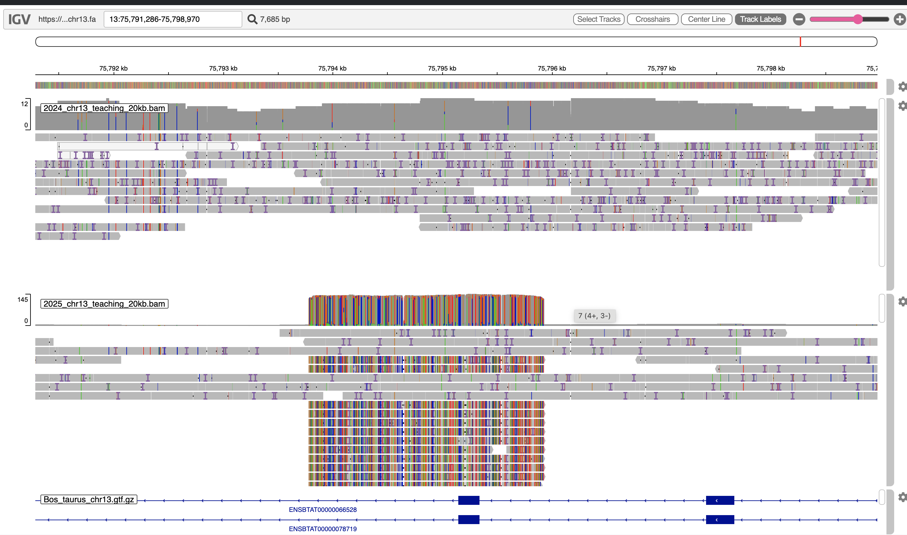

# Overview of the tutorial

This R Markdown document provides the analytical workflow required to process and interpret the sequencing data generated during the wet lab. 

The structure, format, and assessment criteria of the written report and oral presentation are defined in the official course guides. This document focuses on the analytical components that generate the data and figures used in those assessments.


## Learning objectives and course alignment

This practical supports the course Learning Outcomes as follows:

- Understanding nanopore sequencing principles and raw data quality assessment (Knowledge)
- Understanding library preparation concepts (Knowledge)  
- Aligning reads to a reference genome and detecting genomic variants (Knowledge / Skills)
- Critically assessing wet and dry lab results (Skills)  
- Applying methods to a defined scientific question (General competence)  
- Communicating scientific results (General competence)  


{width=80%}

### Data usage and analytical structure

<div style="background-color: #e6f2ff; padding: 10px; border-radius: 5px;">
**Part A** is conducted using the sequencing data generated from your own wet lab experiment.  
The objective is to directly compare how different physical DNA treatments (Control, Vortex, Needle, Temperature stress) influence sequencing performance metrics, including read length distribution, sequencing yield, and base quality before and after filtering.  
This section establishes the causal link between laboratory manipulation and sequencing outcomes.


**Parts B and C** extend the analysis to mapping, structural variant detection, and biological interpretation.  
Because full mapping and variant calling workflows on complete raw datasets are computationally intensive and require extended runtime on HPC infrastructure, a pre-processed and region-restricted dataset derived from previous sequencing runs is used for these sections.  


This ensures that all students can complete the advanced analytical workflow within the allocated practical session while working with high-quality, reproducible example data suitable for interpretation in IGV and downstream biological analysis.

**Together, Part A and Parts B–C form an analytical progression:  
from experimental manipulation and quality assessment (wet-to-sequencing outcomes) to genomic localization and biological interpretation (sequencing-to-function).**

</div>


## For your report assignment

(1) Part A
Using the read quality values before and after filtering in the shared table (in Part A)
Examine the effect of different DNA treatment methods on read quality and length.


(2) Part C
Select one structural variant locus from the table provided (in Part C) and investigate it in IGV.
Report the genomic coordinates, variant type and size, genotype comparison between the 2024 and 2025 samples, whether the variant overlaps any genes, and briefly discuss the potential functional consequence for the affected gene.


### Review basic command usages


[WorkingWithSigma](https://github.com/TheMEMOLab/Bio326-NMBU/blob/main/Doc/HPC-101-WorkingWithSigma2.md)


[File transfer between Sigma2 and your computer](https://training.pages.sigma2.no/tutorials/hpc-intro/episodes/15-transferring-files.html)


# Part A. Read quality check (Core Activity)

## Overview
### Objective

<div style="background-color: #e6f2ff; padding: 10px; border-radius: 5px;">
To quantitatively evaluate how different physical DNA treatments (Control, Vortex, Needle shearing, and Temperature extreme) influence long-read sequencing performance by comparing read length distribution, sequencing yield, and base quality metrics before and after quality filtering.
</div>


### Experimental origin of the sequencing data

The FASTQ files analyzed in this section originate from four treatments performed during the wet laboratory session:

- Control  
- Vortex  
- Needle shearing  
- Temperature extreme (freeze–thaw stress)

Following DNA extraction, concentrations were quantified using Qubit fluorometry.  
Samples were normalized to equal DNA mass per barcode, barcoded individually, pooled, and sequenced using Oxford Nanopore technology.


## Connect to Sigma2 and prepare the tools


In the Terminal/Command prompt, go to Sigma2 and your directory there.

[Let's review how to do so](https://github.com/TheMEMOLab/Bio326-NMBU/blob/main/Doc/HPC-101-WorkingWithSigma2.md)


```{bash,eval=FALSE}
ssh yourID@saga.sigma2.no
```


Let's make a directory for analysis and enter it.

```{bash,eval=FALSE}
mkdir analysis # make directory "analysis"
cd analysis # set the current directory "analysis"

```


Now, you will inspect the fastq file from your experiment, which contains Nanopore read information.


### DNA Quantification and Barcoding Overview

Before proceeding with the analysis, review the metadata corresponding to your assigned group.

Please identify:

- Your **Sample ID**
- The corresponding **Treatment condition**
- The assigned **Barcode ID**

You can find the complete overview of samples and barcodes in [the shared spreadsheet](https://docs.google.com/spreadsheets/d/1VvkG2FId57kSaE9hbZ7QUlzNcrFbAd9GI68F0T_QA5I/edit?gid=0#gid=0)


Confirm that the FASTQ file you are working with matches your assigned barcode and treatment condition before running NanoPlot.


<div style="background-color: #e6f2ff; padding: 10px; border-radius: 5px;">
All the data is now here:
 
/cluster/projects/nn9987k/BIO326-2025/data_euk_2026/merged_fastq
 
Concatenated fastq files are named according to barcode NB:
 
NB01.fq.gz  NB03.fq.gz  NB05.fq.gz  NB07.fq.gz  NB09.fq.gz  NB11.fq.gz  NB13.fq.gz  NB15.fq.gz  NB17.fq.gz  NB19.fq.gz
NB02.fq.gz  NB04.fq.gz  NB06.fq.gz  NB08.fq.gz  NB10.fq.gz  NB12.fq.gz  NB14.fq.gz  NB16.fq.gz  NB18.fq.gz  NB20.fq.gz
</div>


## Explore the structure of a FASTQ file

### Inspect the file structure

Open your FASTQ file and examine its structure.

```{bash, eval=FALSE}
zcat YourSample.fq.gz | head -20
```


FASTQ format uses 4 lines per read:
1. Header
2. Sequence
3. "+"
4. Quality string


FASTQ files contain both nucleotide sequences and per-base [quality scores](https://help.basespace.illumina.com/files-used-by-basespace/quality-scores)

- by [Illumina Knowledge](https://knowledge.illumina.com/software/general/software-general-reference_material-list/000002211)


### Count total lines and calculate number of reads

```{bash, eval=FALSE}
zcat YourSample.fq.gz | wc -l
```


FASTQ uses 4 lines per read.

You can calculate the number of reads with:

    LINES=$(zcat YourSample.fq.gz | wc -l)
    echo $((LINES / 4))


The total number of reads reflects **sequencing yield.**
This will later be compared between treatments and after filtering.


### Compare quality positions

```{bash, eval=FALSE}
zcat YourSample.fq.gz | sed -n 4p | cut -c 1-5
zcat YourSample.fq.gz | sed -n 4p | cut -c 21-25
```

Quality scores are encoded using Phred+33.
Quality may vary along the read due to sequencing chemistry.


### Extract one read longer than 10 kb

```{bash, eval=FALSE}
zcat YourSample.fq.gz | awk 'NR%4==2 && length($0) > 10000 {print; exit}'
```

Long reads are a key advantage of Nanopore sequencing.
Read length distribution will later be compared across treatments.


## Quality check by Nanoplot

The original fastq files may contain low quality reads. In this step, we will use "Nanoplot" to see the quality and length of each read.


Make a slurm script to conduct the quality check on the sample file like below and run it. 


[Review: make a slurm script and run it by sbatch](https://github.com/TheMEMOLab/Bio326-NMBU/blob/main/Doc/HPC-101-WorkingWithSigma2.md)


```{bash,eval=FALSE}

#!/bin/bash
#SBATCH --job-name=Nanoplot  # sensible name for the job
#SBATCH --mem=12G 
#SBATCH --ntasks=1   
#SBATCH --cpus-per-task=8
#SBATCH --output=nanoplot_before 
#SBATCH --account=nn9987k
#SBATCH --time=20:00  


##Activate conda environment
module load StdEnv
module load Miniconda3/23.10.0-1
source ${EBROOTMINICONDA3}/bin/activate 


conda activate /cluster/projects/nn9987k/.share/conda_environments/EUK_DRY

echo "Working with this $CONDA_PREFIX environment ..."


## run nanoplot

NanoPlot -t 8  --fastq /cluster/projects/nn9987k/BIO326-2025/day1/1-A.fq.gz --plots dot  --no_supplementary --no_static --N50 -p before_filter_A1


```


Nanoplot will generate the result files, named "before_filter_A1"xxx. Let's look into them... 


```{bash,eval=FALSE}

# Taking too long?
srun \
--account=nn9987k \
--partition=normal \
--gres=localscratch:10G \
--cpus-per-task 4 \
--nodes 1 \
--mem=10G \
--time=02:00:00 \
--pty bash \
-i

cp /cluster/projects/nn9987k/BIO326-2025/day1/before_filter_A1NanoPlot-report.html  before_filter_A1NanoPlot-report.html

```

Open "before_filter_A1NanoPlot-report.html" **on your local computer**. 
[Review: File transfer between Sigma2 and your computer](https://training.pages.sigma2.no/tutorials/hpc-intro/episodes/15-transferring-files.html)


<details>
<summary><strong>Then you will see something like below:
(click)</strong></summary>


{width=80%}

{width=80%}

{width=80%}


- Compare mean vs median read length. A large difference suggests a skewed distribution with a long tail of very long reads.  
- N50 reflects the read length at which 50% of the total bases are contained in reads of that length or longer.  
- Compare mean read quality and median read quality. Differences may indicate heterogeneity in read quality distribution.


Together, these metrics capture the trade-off between yield and quality before and after filtering.

</details>


## Filtering by Nanofilt


Now you will filter the obtained reads by length and read quality.


```{bash,eval=FALSE}

#!/bin/bash
#SBATCH --job-name=Nanofilt  # sensible name for the job
#SBATCH --mem=12G 
#SBATCH --ntasks=1   
#SBATCH --output=nanofilt 
#SBATCH --account=nn9987k
#SBATCH --time=20:00  


##Activate conda environment
module load StdEnv
module load Miniconda3/23.10.0-1
source ${EBROOTMINICONDA3}/bin/activate 


conda activate /cluster/projects/nn9987k/.share/conda_environments/EUK_DRY

echo "Working with this $CONDA_PREFIX environment ..."


## run nanoplot
gunzip -c /cluster/projects/nn9987k/BIO326-2025/day1/1-A.fq.gz | NanoFilt -q 12 -l 1000 | gzip > cleaned_A1.fq.gz

```


<details>
<summary><strong>Parameters and Conda explained(click)</strong></summary>
This script activates a Conda environment (Your toolkit that Arturo pre-assembled) on a computing cluster:


This script activates a Conda environment on a computing cluster.

- `module load StdEnv`  
  Loads the standard software environment.

- `module load Miniconda3/23.10.0-1`  
  Loads Miniconda, a lightweight Conda distribution.

- `source ${EBROOTMINICONDA3}/bin/activate`  
  Activates the base Miniconda installation.

- `conda activate EUK_DRY`  
  Activates the project-specific Conda environment.

- `echo "Working with this $CONDA_PREFIX environment ..."`  
  Prints the path of the currently active Conda environment.


| Q Score < 12 | error rate cutoff |
| Length < 1000 bp | read length cutoff |


-l,  Filter on a minimum read length

-q, Filter on a minimum average read quality score

In this case, we are removing reads lower than quality score 12 and shorter than 1000 bases.

</details>


If you are ambitious, please adjust the filtering parameters and see how they change the result.

**(In that case, do not forget to name the result files differently.)**


## Compare the sequences before and after cleaning

Run Nanoplot again on the cleaned sequences, and compare the quality metrics before and after the filtering.


<details>
  <summary> **Need help? (click)** </summary>      
  
  
```{bash,eval=FALSE}

#!/bin/bash
#SBATCH --job-name=Nanoplot  # sensible name for the job
#SBATCH --mem=12G 
#SBATCH --ntasks=1   
#SBATCH --cpus-per-task=8
#SBATCH --output=nanoplot_after 
#SBATCH --account=nn9987k
#SBATCH --time=20:00  


##Activate conda environment
module load StdEnv
module load Miniconda3/23.10.0-1
source ${EBROOTMINICONDA3}/bin/activate 


conda activate /cluster/projects/nn9987k/.share/conda_environments/EUK_DRY

echo "Working with this $CONDA_PREFIX environment ..."


## run nanoplot

NanoPlot -t 8  --fastq cleaned_A1.fq.gz --plots dot  --no_supplementary --no_static --N50 -p after_filter_A1


```

</details> 

Open "after_filter_A1NanoPlot-report.html" **on your local computer.**


{width=80%}


{width=80%}


### Discussion Point

Did you see the difference of read and quality distribution between before and after the filtering? Discuss within/between groups.


## Core Activity: Quality Metrics Reporting

<div style="background-color: #e6f2ff; padding: 10px; border-radius: 5px;">

 **Your mission**

</div>

 After running NanoPlot on your dataset (before and after filtering), extract the following summary statistics and enter them into [**the shared spreadsheet**](https://docs.google.com/spreadsheets/d/1VvkG2FId57kSaE9hbZ7QUlzNcrFbAd9GI68F0T_QA5I/edit?gid=0#gid=0):

 - Total reads  
 - Total bases  
 - Read N50  
 - Mean read quality  

 Record these values for both:

 - **Before filtering**
 - **After filtering**

 Use the NanoPlot summary report (.html or .txt) to retrieve the metrics.  
 Ensure that you enter values corresponding to your assigned sample and treatment.

 The purpose of this activity is to compare sequencing yield and quality before and after filtering across treatments.
 


# Part B. Mapping to the reference genome 


## Objective


<div style="background-color: #e6f2ff; padding: 10px; border-radius: 5px;">

To understand the core logic of read mapping and structural variant calling by running (or inspecting) a minimal long-read pipeline:
1) map reads to a reference genome,  
2) generate a sorted/indexed BAM file,  
3) call structural variants (SVs) into a VCF file,  
4) inspect variant records and interpret key fields (SVTYPE, SVLEN, GT).

</div>

{width=90%}

### What is Read Mapping?  
- Aligning sequencing reads to a reference genome.  
- Essential for variant detection to find out which region is different from your sample and standard sample.  


## Run Minimap and map the reads to the reference genome


```{bash,eval=FALSE}
#!/bin/bash
#SBATCH --job-name=Sniffles # sensible name for the job
#SBATCH --mem=12G 
#SBATCH --ntasks=1   
#SBATCH --cpus-per-task=8
#SBATCH --output=mapping 
#SBATCH --account=nn9987k
#SBATCH --time=20:00  

##Activate conda environment
module load StdEnv
module load Miniconda3/23.10.0-1
source ${EBROOTMINICONDA3}/bin/activate 

echo "Working with this $CONDA_PREFIX environment ..."

conda activate /cluster/projects/nn9987k/.share/conda_environments/EUK_DRY

minimap2 -t 8 -ax map-ont /cluster/projects/nn9987k/BIO326-2025/day2/Bos_taurus_chr13.fa  /cluster/projects/nn9987k/BIO326-2025/day2/2025_chr13_teaching_20kb.fastq.gz > 2025_chr13.sam


# convert the sam file to bam format
samtools view -S -b 2025_chr13.sam > 2025_chr13_temp.bam

## sort the bam file
samtools sort 2025_chr13_temp.bam -o 2025_chr13.bam

# index the bam file
samtools index -M  2025_chr13.bam

# Variant Calling using Sniffles
sniffles --input  2025_chr13.bam --vcf 2025_chr13.vcf


```


<details> 
<summary><strong>What each step is doing (click)</strong></summary>

Workflow Overview

| Command | Purpose |
|----------|----------|
| `minimap2 ... > 2025_chr13.sam` | Maps long reads to the reference genome and outputs SAM format. |
| `samtools view ... > 2025_chr13_temp.bam` | Converts SAM to compressed BAM format. |
| `samtools sort ... -o 2025_chr13.bam` | Sorts alignments by coordinate for downstream compatibility. |
| `samtools index ... 2025_chr13.bam` | Creates BAM index for random genomic access. |
| `sniffles ... --vcf 2025_chr13.vcf` | Detects structural variants and outputs VCF file. |

</details>


### What is Variant Calling?  
- Identifying differences between sequenced DNA and a reference genome.  
- Important for studying mutations and genetic variation.  
[bam and sam format](https://labs.epi2me.io/reviewing-bam/)

Note: Mapping and variant calling is time consuming, but you can find the output file here: /cluster/projects/nn9987k/BIO326-2025/day2/2025_chr13.vcf


Now you got the variant file!

## Investigate the variants


Copy the vcf in your directory

```{bash,eval=FALSE}
qlogin 

cp /cluster/projects/nn9987k/BIO326-2025/day2/2025_chr13.vcf  2025_chr13.vcf 


```

Look inside the vcf

```{bash,eval=FALSE}
# INFO field

grep '^##' 2025_chr13.vcf | tail -n 20
```


<details> 
<summary><strong>INFO Field Descriptions</strong></summary>

| Field | Description |
|--------|-------------|
| `MOSAIC` | Structural variation classified as putative mosaic |
| `SVLEN` | Length of structural variation |
| `SVTYPE` | Type of structural variation (INS, DEL, BND, etc.) |
| `CHR2` | Mate chromosome for BND structural variants |
| `SUPPORT` | Number of reads supporting the structural variation |
| `SUPPORT_INLINE` | Reads supporting INS/DEL without split alignments |
| `SUPPORT_SA` | Reads supporting DEL via supplementary alignments |
| `SUPPORT_LONG` | Soft-clipped reads supporting long insertions |
| `END` | End position of the structural variation |
| `STDEV_POS` | Standard deviation of variant start position |
| `STDEV_LEN` | Standard deviation of variant length |
| `COVERAGE` | Coverage at upstream, start, center, end, downstream positions |
| `STRAND` | Strand orientation of supporting reads |
| `AC` | Allele count across all samples |
| `SUPP_VEC` | Per-sample support vector |
| `CONSENSUS_SUPPORT` | Reads supporting insertion consensus sequence |
| `RNAMES` | Names of supporting reads (if enabled) |
| `VAF` | Variant Allele Fraction |
| `NM` | Mean mismatch rate of supporting reads |
| `PHASE` | Phasing information derived from supporting reads |

</details>


```{bash,eval=FALSE}
# variants
grep -v '^##' 2025_chr13.vcf | more


```

<details> 
<summary><strong>Field Interpretation</strong></summary>

| Field | Meaning |
|--------|---------|
| `SVTYPE` | Structural variant type (INS = insertion, DEL = deletion) |
| `SVLEN` | Variant length (negative values indicate deletions) |
| `SUPPORT` | Number of reads supporting the variant |
| `VAF` | Variant allele frequency |
| `GT` | Genotype (0/1 = heterozygous, 1/1 = homozygous alternate) |
| `DR` | Reads supporting the reference allele |
| `DV` | Reads supporting the variant allele |

</details>


Now you have variants! Lets see which genes are affected by the variants... in Part C!


# Part C. Estimate the effect of variants


## Overview

In this practical, you will explore high-confidence structural variants (SVs) detected from long-read sequencing data in two samples (2024 and 2025).  

The dataset has been reduced to chromosome 13 around selected SVs to ensure fast loading in Integrative Genome Viewer(IGV).

You will:
- Visualize structural variants in IGV  
- Compare genotypes between two samples  
- Interpret read-level evidence  
- Examine gene overlap  
- Investigate biological function  


## Download the dataset from Figshare:


https://figshare.com/articles/dataset/BIO326_2026/31323997

After downloading, unzip the folder and keep all files together in the same directory.


Reference
 
- `Bos_taurus_chr13.fa`  
- `Bos_taurus_chr13.fa.fai`  

Alignment files

- `2024_chr13_teaching_20kb.bam`  
- `2024_chr13_teaching_20kb.bam.bai`  
- `2025_chr13_teaching_20kb.bam`  
- `2025_chr13_teaching_20kb.bam.bai`  

Variant file
- `joint_chr13_teaching_20kb.vcf.gz`  
- `joint_chr13_teaching_20kb.vcf.gz.tbi`  


Gene annotation
- `Bos_taurus_chr13.gtf.gz`  
- `Bos_taurus_chr13.gtf.gz.tbi`  


<details>
<summary><strong>File Formats Explained (click)</strong></summary>

File Formats Explained

1) FASTA format (.fa)

The FASTA file contains the reference DNA sequence.

Example:

    >13
    ATGCTAGCTAGCTAGCTAGCTAGCTAGCTAGCTAGCTAGCTAGCTA...

Structure:

| Component | Meaning |
|-----------|----------|
| > line | Sequence header (chromosome name) |
| DNA letters | Reference nucleotide sequence (A, T, C, G) |

IGV uses this file as the coordinate system.


2) FASTA index (.fai)

Generated by samtools faidx.

Example:

    13 84296534 4 60 61

| Column | Meaning |
|--------|----------|
| 1 | Sequence name |
| 2 | Length |
| 3 | Offset in file |
| 4 | Bases per line |
| 5 | Bytes per line |

Purpose:
- Enables rapid random access
- Required by IGV


3) BAM format (.bam)

BAM is a compressed binary alignment file.  
It stores how sequencing reads align to the reference.

Example (SAM view):

    read001  0  13  1720605  60  150M  *  0  0  ACTG...  FFFFF...

Core columns:

| Column | Meaning |
|--------|----------|
| QNAME | Read name |
| FLAG | Alignment flags |
| RNAME | Chromosome |
| POS | Start position |
| MAPQ | Mapping quality |
| CIGAR | Alignment pattern |
| SEQ | Read sequence |
| QUAL | Base quality |


4) VCF format (.vcf)

Variant Call Format stores detected variants.

Example (simplified):

    13 1720605 Sniffles2.DEL.2FMC N <DEL> 52 PASS PRECISE;SVTYPE=DEL;SVLEN=-1174;END=1721780;SUPPORT=8 GT:GQ:DR:DV 1/1:40:0:8 0/0:35:7:0

Core columns:

| Column | Meaning |
|--------|----------|
| CHROM | Chromosome |
| POS | Start position |
| ID | Variant ID |
| REF | Reference allele |
| ALT | Alternate allele |
| QUAL | Quality score |
| FILTER | PASS or filtered |
| INFO | Variant metadata |
| FORMAT | Genotype structure |
| Sample columns | Per-sample genotype values |

Important INFO fields:

| Field | Meaning |
|--------|----------|
| SVTYPE | DEL or INS |
| SVLEN | Variant length |
| END | End coordinate |
| SUPPORT | Read support |
| PRECISE | Breakpoint confidence |

Important FORMAT fields:

| Field | Meaning |
|--------|----------|
| GT | Genotype (0/0, 1/1) |
| DR | Reference read count |
| DV | Variant read count |
| GQ | Genotype quality |


5) GTF format (.gtf)

Gene annotation format.

Example:

    13 ensembl gene 1720000 1735000 . + . gene_id "ENSBTAG00000008338"; gene_name "PLCB1";

Columns:

| Column | Meaning |
|--------|----------|
| 1 | Chromosome |
| 2 | Source |
| 3 | Feature type |
| 4 | Start |
| 5 | End |
| 7 | Strand |
| 9 | Attributes |

Used in IGV to display gene models.

</details>


## Load the data in IGV

1. Open IGV.
 https://igv.org/app/
 

| File Type | Role in IGV |
|------------|-------------|
| FASTA | Defines coordinate system |
| BAM | Shows aligned reads (evidence) |
| VCF | Shows called variants (summary) |
| GTF | Shows gene structure (context) |


2. Load the reference: **Genomes → Load Genome from File…** → `Bos_taurus_chr13.fa`  
3. Load tracks: **File → Load from File…** and add:
   - `joint_chr13_teaching_20kb.vcf.gz`
   - `2024_chr13_teaching_20kb.bam`
   - `2025_chr13_teaching_20kb.bam`
   - `Bos_taurus_chr13.gtf.gz`


## Structural Variant Loci to Explore

Below are the structural variants detected on chromosome 13.  
Choose a locus you like and investigate it in IGV.

| Chrom | Start | End | ID | Type | Length | Gene |
|------|-------|------|----------------------|------|--------|----------------------|
| 13 | 1720605 | 1721780 | Sniffles2.DEL.2FMC | DEL | -1174 | ENSBTAG00000008338 |
| 13 | 8238127 | 8238128 | Sniffles2.INS.86MC | INS | 3404 | ENSBTAG00000034441 |
| 13 | 40007605 | 40007755 | Sniffles2.DEL.1B4MC | DEL | -149 | ENSBTAG00000014178 |
| 13 | 46710350 | 46710351 | Sniffles2.INS.1F6MC | INS | 51 | ENSBTAG00000006531 |
| 13 | 47767130 | 47767178 | Sniffles2.DEL.1FEMC | DEL | -47 | ENSBTAG00000008293 |
| 13 | 74258437 | 74258438 | Sniffles2.INS.2ECMC | INS | 114 | ENSBTAG00000017328 |
| 13 | 75795925 | 75795926 | Sniffles2.BND.2F6MC | BND | NA | ENSBTAG00000013114 |
| 13 | 77829615 | 77829701 | Sniffles2.DEL.309MC | DEL | -85 | ENSBTAG00000012626 |


1. Copy a coordinate (for example: `13:46710350`) into the IGV search bar.  
2. Compare the 2024 and 2025 BAM tracks.  
3. Determine:
   - Do the genotypes differ between samples?
   - Does the variant overlap an exon, intron, or intergenic region?


## **For your report assignment**

<div style="background-color: #e6f2ff; padding: 10px; border-radius: 5px;">
Select one structural variant locus from the table provided and investigate it in IGV.
Report the genomic coordinates, variant type and size, genotype comparison between the 2024 and 2025 samples, whether the variant overlaps any genes, and briefly discuss the potential functional consequence for the affected gene.
</div>

## Example views 

**Example locus1**

**Sniffles2.INS.1F6MC — 13:46710350–46710351 — 51 bp insertion — ENSBTAG00000006531 (DIP2C)**


{width=80%}

This locus corresponds to a 51 bp insertion at position 46,710,350 on chromosome 13. 

In IGV, the 2024 sample shows continuous read alignment across the site with no consistent breakpoint or inserted sequence, indicating a reference genotype at this position. 

In contrast, the 2025 sample displays multiple independent reads containing the same inserted sequence at the identical coordinate, with split alignment patterns and clear insertion labeling in IGV, supporting the presence of the insertion allele. 

According to the gene annotation track, the variant lies within the ENSBTAG00000006531 locus, corresponding to DIP2C. If located within an exon, a 51 bp insertion could alter the coding sequence while preserving the reading frame, potentially modifying protein structure. 


**Example locus2**

**Sniffles2.BND.2F6MC — 13:75795925–75795926 — BND — ENSBTAG00000013114**

{width=80%}


At this locus, compare the two samples directly.


In the 2024 sample, read coverage is uniform, mismatches are scattered, and there is no clustering of discordant alignments, indicating absence of a structural rearrangement. 

In 2025, focus on the central region where the reads form a dense, colorful block. The vertical colored lines indicate many mismatches concentrated in the same short interval. Multiple reads show discordant alignment in the same position. When many reads change relative to the reference at the exact same coordinates, this is not random sequencing error. 


This pattern suggests an inversion or a highly divergent sequence present in 2025 but absent in 2024. 

The locus overlaps ENSBTAG00000013114. A breakend event within a gene may disrupt coding sequence continuity or regulatory structure, depending on whether the breakpoint falls within an exon or intron.


## Well Done!

That's it! You are now an expert in genome analysis!

If you are interested in a similar bioinformatics or genomics project for your master’s thesis, please contact our lab:
<a href="https://sites.google.com/view/saitou-lab/home">Saitou Lab</a>


 


