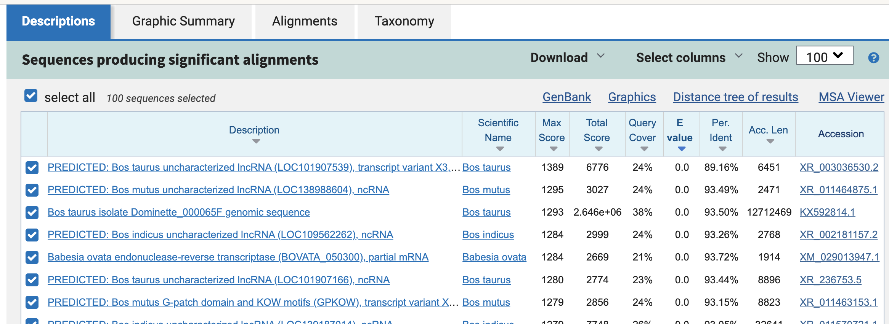

# Overview of the tutorial

Using the data from the Nanopore sequencing you conducted,

🎯 **Goals of this session:** 

- Compare the read length and quality between the experimental conditions

- Investigate how the read cleaning process affect the read yields

- Identify the genomic variants from the sequence data

- Interpret how the genomic variants affects the animal biologically


🎯 **We will learn:** 

 - How to use Sigma2 and conduct genome analysis 
 
 - Quality check, read filtering, mapping to the reference genome and variant calling

 - How to interpret summary statistics of Nanopore sequence data

 - How to identify and interpret genetic variants


{width=80%}


# Part A. Read quality check

🔎 Overview:

(1) Quality check -> Trimming of low quality reads -> Quality check

(2) Compare the overall reads quality between conditions 


## Connect to Sigma2 and the prepare the tools


🚀In the Terminal/Command prompt, go to Sigma2 and your directory there.

[Let's review how to do so](https://github.com/TheMEMOLab/Bio326-NMBU/blob/main/Doc/HPC-101-WorkingWithSigma2.md)


```{bash,eval=FALSE}
ssh yourID@saga.sigma2.no
```


Let's make a directory for analysis and enter in it.

```{bash,eval=FALSE}
mkdir analysis # make directory "analysis"
cd analysis # set the current directory "analysis"

```

Now, you will inspect the fastq file from your experiment, which contains Nanopore read information.

## Check the read quality by Nanoplot
###  Browse the inside of the read (fastq) file


Let's learn how a fastq file (sequencing reads) looks using a sample file (1-A).

```{bash,eval=FALSE}
zcat /cluster/projects/nn9987k/BIO326-2025/day1/1-A.fq.gz | more
```


🔎 Now you are seeing the content of a fastq file. (.gz = compressed)

Each entry in a FASTQ files consists of 4 lines:

1. A sequence identifier with information about the sequencing run. (run time, run ID, cflow cell id ... )

2. The sequence (the base calls; A, C, T, G and N).

3. A separator, which is simply a plus (+) sign.

4. The base call quality scores. These are Phred +33 encoded, using ASCII characters to represent the numerical quality scores." [quality score sheet](https://learn.gencore.bio.nyu.edu/ngs-file-formats/quality-scores/)

- by [Illumina Knowledge](https://knowledge.illumina.com/software/general/software-general-reference_material-list/000002211)


{width=80%}


###  Get basic stats of the fastq file

"zcat"-> look inside

"wc" -> word count

"-l" -> line

```{bash,eval=FALSE}
zcat /cluster/projects/nn9987k/BIO326-2025/day1/1-A.fq.gz | wc -l
```


{width=80%}


### **Discussion Point**

🔎 Now you got the number of lines in the fastq file.

How many sequence reads are in the fastq file?

What is the quality of bp between 1 and 5? What is the quality of bp between 21 and 25? Why do you think they are different?

What is this species?


<details>
  <summary> **Need Help? (click)** </summary>      

We see that there are 364544 lines in the fastq file. 

As we learned that "each entry in a FASTQ files consists of 4 lines", one read is corresponding to four lines. So in this file we have 364544/4 = 91136 reads.

Hint for the 5 first bp: 
```{bash,eval=FALSE}
zcat /cluster/projects/nn9987k/BIO326-2025/day1/1-A.fq.gz | sed -n 4p | cut -c 1-5
```


</details> 


## Quality check by Nanoplot

The original fastq files may contain low quality reads. In this step, we will use "Nanoplot" to see the quality and lentgh of each read.


🛠 Make a slurm script to conduct the quality check on the sample file like below and run it. 


[Review: make a slurm script and run it by sbatch](https://github.com/TheMEMOLab/Bio326-NMBU/blob/main/Doc/HPC-101-WorkingWithSigma2.md)


```{bash,eval=FALSE}

#!/bin/bash
#SBATCH --job-name=Nanoplot  # sensible name for the job
#SBATCH --mem=12G 
#SBATCH --ntasks=1   
#SBATCH --cpus-per-task=8
#SBATCH --output=nanoplot_before 
#SBATCH --account=nn9987k
#SBATCH --time=20:00  


##Activate conda environment
module load StdEnv
module load Miniconda3/23.10.0-1
source ${EBROOTMINICONDA3}/bin/activate 


conda activate /cluster/projects/nn9987k/.share/conda_environments/EUK_DRY

echo "Working with this $CONDA_PREFIX environment ..."


## run nanoplot

NanoPlot -t 8  --fastq /cluster/projects/nn9987k/BIO326-2025/day1/1-A.fq.gz --plots dot  --no_supplementary --no_static --N50 -p before_filter_A1


```


Nanoplot will generate the result files, named "before_filter_A1"xxx. Lets look into them... 

[Review: File transfer between Sigma2 and your computer](https://training.pages.sigma2.no/tutorials/hpc-intro/episodes/15-transferring-files.html)


```{bash,eval=FALSE}

# taking too long?
qlogin 

cp /cluster/projects/nn9987k/BIO326-2025/day1/before_filter_A1NanoPlot-report.html  before_filter_A1NanoPlot-report.html

```

🔎 Open "before_filter_A1NanoPlot-report.html" on your local computer


{width=80%}

{width=80%}

{width=80%}


##Filtering by Nanofilt
```{bash,eval=FALSE}

#!/bin/bash
#SBATCH --job-name=Nanofilt  # sensible name for the job
#SBATCH --mem=12G 
#SBATCH --ntasks=1   
#SBATCH --output=nanofilt 
#SBATCH --account=nn9987k
#SBATCH --time=20:00  


##Activate conda environment
module load StdEnv
module load Miniconda3/23.10.0-1
source ${EBROOTMINICONDA3}/bin/activate 


conda activate /cluster/projects/nn9987k/.share/conda_environments/EUK_DRY

echo "Working with this $CONDA_PREFIX environment ..."


## run nanoplot
gunzip -c /cluster/projects/nn9987k/BIO326-2025/day1/1-A.fq.gz | NanoFilt -q 12 -l 1000 | gzip > cleaned_A1.fq.gz

```


This script activates a Conda environment (Your toolkit that Arturo pre-assembled) on a computing cluster:

1. Load required modules

module load StdEnv → Loads the standard environment.

module load Miniconda3/23.10.0-1 → Loads Miniconda, a lightweight Conda
distribution.

2. Activate Conda

source ${EBROOTMINICONDA3}/bin/activate → Activates Miniconda.

conda activate EUK_DRY → Activates a specific Conda environment for the project.

(3)  Confirm activation

echo "Working with this $CONDA_PREFIX environment ..." → Indicates the currently active Conda environment.


**Parameters**

-l,  Filter on a minimum read length

-q, Filter on a minimum average read quality score

In this case, we are removing reads lower than quality score 12 and shorter than 1000 bases.

If you are ambitious, please adjust the filtering parameters and see how they change the result.

**(In that case, do not forget to name the result files differently.)**


| Q Score < 12 | High error rate |
| Length < 1000bp | Too short for meaningful mapping |


## Compare the sequences before and after cleaning

🚀 Run Nanoplot again on the cleaned sequences.


<details>
  <summary> **Need help? (click)** </summary>      
  
```{bash,eval=FALSE}

#!/bin/bash
#SBATCH --job-name=Nanoplot  # sensible name for the job
#SBATCH --mem=12G 
#SBATCH --ntasks=1   
#SBATCH --cpus-per-task=8
#SBATCH --output=nanoplot_after 
#SBATCH --account=nn9987k
#SBATCH --time=20:00  


##Activate conda environment
module load StdEnv
module load Miniconda3/23.10.0-1
source ${EBROOTMINICONDA3}/bin/activate 


conda activate /cluster/projects/nn9987k/.share/conda_environments/EUK_DRY

echo "Working with this $CONDA_PREFIX environment ..."


## run nanoplot

NanoPlot -t 8  --fastq cleaned_A1.fq.gz --plots dot  --no_supplementary --no_static --N50 -p after_filter_A1


```

</details> 

🔎 Open "after_filter_A1NanoPlot-report.html" on your local computer.

```{bash,eval=FALSE}

# taking too long?
qlogin 

cp /cluster/projects/nn9987k/BIO326-2025/day1/after_filter_A1NanoPlot-report.html after_filter_A1NanoPlot-report.html

```


{width=80%}


{width=80%}


### **Discussion Point**

- 1. Did you see the difference of read and quality distribution between before and after the filtering? Discuss within/between groups.

- 2. What species is this? (That should be Eukaryote)

Hint 1 ⚠️ **Notice!** The first few thousand reads might be short/unreliable.


<details>
<summary> Hint 2 🔍 Try looking at the **2001st read** (click) </summary>

```{bash,eval=FALSE}
zcat cleaned_A1.fq.gz | tail -n +2001 | awk 'NR%4==2 && length($0) > 1000' | head -1

```
</details>

<details>
<summary> Result: the **2001st read** (click) </summary>

```{bash,eval=FALSE}
TGCCACTTACTTCGTTCAGTTACGTATTGCTAAGGTTAAACAGACGACTACAAACGGAATCGACAGCACCTTAGAGACAAGCAAAGGAGACAGAAACTGGATAGAAGGTCAAATCATTAAACCCTCAGTACCTACCACAAGTGGGTTTTTTGAACTTCACATCCACTTTCCTCACATGCCATAGCTGTGCTAATATCTCTTTTATACACAAGAAAAAAAAAAAAAAAACTTCCCACATATGTAATTTTTTTCTCCCAAAATTTCTAATATCATCATGGTCACAAAATGACTGCCTCATCCCCAAGAATCTTATCTATGCTCCAGATAGGCTTCACTGAATAGGAGAAGCCCTTCCCAGTTTCTGGGGAAAAGATATAAATTTATGTATTACCAATTATTACATATTAATAACTATTTAAGTTGTGGTTTTCAGAAAGCTAACTGGCACCAAATATCCAATTTACTCTCTGGTCATTTAGTAAGCCTTATAATCAGCTCTCTGGGTAGTTGCTCCCTGTCATTCAAGGAATAAAGGAATGTGTGCATGTGTGTTCAGTCATTGAGTCATGTCTGACTTTGTGACCCCATGGACTGTAGTTGCCAGACTCCTCTATCCATGTGGTTCTCCAGGCAAGAATACTAGAGCGGGGGGTGGTGGGGAGTGAGTGGGGAGTATGATCAGAGAGACTCTTCCACTTATGCAGAGGAAGAATATTCCAGCCTCAAATTCAAGATGGCGAGTTGTCTGAATCCTGGTAAGAATTGCTATACTCTTGGTTCCACCATAGGATTGATTAGTACGTCAAAAGCAAAAACAATAACACATTCCTATTTCTTAGAAAAAGTGACTGTGAAACACAGCAGATGTGCTAGATGCCAAATACTCCCCAACTCTGGCCAGATCAACAGACGTGACGCCTGTCCAAATGCAAAGACAGCATAGAATCACCCAAGACCAATAAAATAATCATGATAATATAGCTAGCACAGCCTTTGTGGCAGGTATTATCATAAGTTTTTCACATAAAATAACCCACTTAATTCCCCACAACAACCTTATATGGGAAGAACTATTATTGTCTCTATTTTAAAGAAGAAGGAACCAGGAACAGGGAAGTTAAGTAATTTTGCTCATGGTCAACAGCTTGAAATTAGCATTCTGTCCCGAGAGTCTATGATTTTACCTACTATGCTGACCTAAAAGCATATATTCCCACAAGAAATGTACAATCCTATTAGAAAAAAGTCCAAATAAAAGTTACAAGAATACTCACAGACAAGGTATTAGATTGAACAGAAAAATTAAGGACTTGTAAGTGACACACTATGTTAATAAAGAGAGAATTTTCAATATCTCTAATCATTAGGGAAATGCAAATCAAAACTATCATGAGGTGTCATCTCATACCAATCAGAATGGCCATCAGCAAAAACTCTACAACTAATAAATGCTGGAGAGGGTGTGAAGAGAAAGGAACCCTCCTACTCTGTTGCTGAGAATGTAAATTGGTGGCCAATATGAAAAACAATATGAATGTTCCTTAAAAAACTAAAACTAGAGCTACCATATGATCACAGTCACACTGCTTGGCATATGTCCAGCAACAACCCTAACTTGTAAAGATACATGTGGCCCAATGCTCATTGCAGCACTCTTGACAACAGCCAAGCCATGGAAGCAAACTAAATGTCCATTGACAGATGAATGGATAAAGAAGATGCAATATATTTATACAATAATATTACTCAACTATAAAAAAGAATTAAATAATGTCATTTGCAGCAACATGGTTGAACCTAGAGATTATCATACTGCTGCTGCTGCTGCTAAGTCACTTCAGTCGTTTCTGACTCTGCGACCCCATAGACTGAAGCCCACCAGGCTTCCCCGTCCCTGGGATTCTCCAGGCAAGAACACTGGAGTGGGTTGCCATTTCCTTCTCCAATGCATGAAAGTGAAAATTGAAAGTGAAGTCGCTCAGTCGTGTCCGACTCTTAGCGACCCCATGGACTACAGCCTACCAGGCTCCTCCATGCATGGGATTTTCCAGGCAAGAGTACTGGAGTGGGGTGCCATTGCCTTCTCTGGATTATCATACTAAATGAAGTCAAAAACAAATATATACTTCATTTATATGTAGGATCTAACAAATGATACAATTGAACTTATTGAACAAATAAATTCATAAACATAGAAAACATTCTCATGGTTACCAAAGGGTTAGGGGGGCTAGTGAGGGGTGGGGAGAGATAAATTAGAAGTTTGAGATTAAAACTTACATACCTTGGTAGCTCAGCTGGTAAAGAATCCACCTGCAATGCAGGAGACCCCAGTTCAATTACTGAGTGGGAAAGATCTCCTGGAGAAGGTATACGCTACCCACTCCAGCATTCTTGCCTGGAGAATCCCCATGGACAGAGGAGCCTGGGAGGCTACAGTCCATGGGGCCACAAAGAATGGAAAACAACTGAGTGACTAAGCACACAGCACGACTTTGTATCAAATAAGTAAGCAACAAGGGCCTACTGTATAGCACAGGGAACTATACTTAACATCTTTTAATAACAGAAAGTGAAGAAGAACTAAAGGGCCTCTTGATGAAAGTATGTGAAAGAGGAGAGTGGAAAAAGTTGGCTTAAAGCTCAACATTCAGAAAACAAAGATCATGGCATCCGGTCCCATCACTTCATGGCAAATAGATGGGGAAACAATGGAAACAGTGGCTGACTTTATTTTTCTGGACTCTAAAATCCTGCAGATGGTGATTTCAGCAATGAAATTAAAAGACGCTTACTCCTTGGAAGGAAAGTTATGACCAACCTAGACAGCATATTAAAAAGCAGAGACATTACTTTATCAACAAAGGTCTGTCTAGTCAAGGCTATAGTTTTTCCAGTGGTCATGTATGGATGTGAGAGTTGGACTGTGAAGAAAGCTGAGTGCAGAAGAATTGATGCTTTTGAACTGTGGTGCTGGAGAAGACTCTTGAGAGTCTGCTGGACTGCAAGGAGATCCAACTAGTCCATCCTAAAGGAGATCAGTCCTGGGTGTTCATTGAAAGGACTGATGATGAAGCTGAAACTCCAATACTTTGGCCACCTGATGTGGAGAGCTGACTCATTTGAAAAGACCCTGATGCTTGGAAAAATTGAGGGCAGGAGGAGAAGGGGATGACAGAAGATGAGATGGTTGGGTGACATCACCGACTCAATGGACATGGGTTTGGGTGGACTTCGGGAGTTGGTGATGGACAGGGAGGCCTGGTGTGCTGTGGTTCATGGGGTTGCAAAGAGTTGGACACGACTGAGCAACTAAACTGAATGGAAAAGAATATATACATGGTATTTATGGACTTTCTTGGTGGCTCAGATGATAAAGAATCTATCTGCAGTTCAGGAGACCCGGGTTCGATCCCTGGGTTGGGAAGATCCCCTGGAGAAGGAAATGGCTACCTACTCTAATATACGTATATAACTGAATCACTTTTCTGTACACTGAAGCTAACACAACACTGTAACTTATACTTCAATTAAAAATAAAAATGAAAAATAAAAGAGCATTTTAATCAGAGAACACCCTGATTCTCTTTGAATTAAACACAACGGATGAGACTACATCTCTCTCCTGTTGCTGTTATTGTTCTTGTTGTTTTGTTTGAAGTTTGTCTAGTAATTGATCCTTTCAATGAACTGTGCTTTAAAAGTATATGCTAAACTTCCTTTCAAAATTTATAAATTTTTGCTTTCACCTTTTTTGCTCCCTTTTGTTTTACATTAGAGATTTGTGATAATATGTCTTGAACCAATTGTAGCTGAAAGCCCTGAAGTTATGCTAAAGATTGGGGTTGATTGATAGATAGCAAGCTCAGTTCTCCCTGTGTGTCCAAGAGCTGGTCAACACAGTTATCCAGCTATTCTGGCAGGTAGCTCTCTGGTTTTATCCTGTTGGTTAAAGAAATGGCCTCACCAGTGCAGATAATCTAACAGGAATAGGAGGCTTCTAACAGCAGTATGGCCTTCCTGAGTGTGCACTGGCCAGAAGAGCATGCCTTCAGATACAATAACCAATTCACCTGGGTTTGCCCAAGACTTTCTCAAGCTTAGCTCTGAAAGTCCCACATTCCAAAAATCCCTCTTTCATGGGACAACAGAAAGAATTGGTCATCCTAGGCCCAGTGCTGTCTTTGACCTTGGGTGAGGCAGTCCAATGTTGAGGCAGGAAACAGAGGTTTCAGAAAAAGACATATCTCAACTCCACCTCTGCCACTTACAGTATAATCTGGGACAAGCCATTTAAACCGAGACACCATTTTCTTTATCTGTAATATAAGGATAACAGCCCTGTGACTTTTTGAGAATTTAATCAGAAGTCATGAAAGATTTCTAGAAAAGTGTCTGGCATAAAGTAGCTGCCCAGCAAATAGTAGGTGTTATTACTATATTCCAGGAATTCTAAAATCAAATAGCAACTATAAAAGCAATTATGTCTAGACAGGTGGTATTTTGGGTTTTTTTTTTTTTTTTTTTTGGTTTCTTTTTTCTTAAATGGGATTATCTATGACTATGGTTATTTCCATTTTTAAAAGTCAATTCATTTGATCGGATTGATTGGCCAAAAATTCATGTTGACTCGTGCTAACTGTTGTAAGATCAAGCACTTTCAAACTTATTCATAAATAACATCCAAGTCATCTTTTCTAAATATTTAAGTTAACAATATAATTGCCTGCTACCCACAGAAGCATCTTCCTTTCAGTAGAATTTTAGAAAGAGGTACACAGAAGAAATACAAAAATGTCTAATTTTCTCCTTTAAGCTATGATATTCTACACTAACCCAGGTTTTTATGTAACAAAGCTCTGGTTTATACTAAGTACATTCTTTAATATTAATTGAAAAGAACTAATTTATAATCTTATGCTTTAACTTCTTGAAACTGACTAATTCTTTTAAAAGGTTTCCTAGGATAAGATCCATTAAATTTTATGATTTTGATTTTTGTATTGATAGTAAATCATTTTTCACCAATGATTTCTTTTGGTGTTTTGTTTTCTCTCAATTCTGAATACAGTTTCTTATACTTGAATTTTTAATAACACAAATAGGATGTATTTTGATTAATTAACTTTAAAATACAATTTCTGATAATCTATCTTCTATAATATATAGATTTTAATTCATAAACTCAAGTATTGATGGAACAGTGGTGCACTAGAATCTATTTTATCTATTTAAGAAATCTTTTCCATTGAGTACAACATTTAATAAGAATTTTCAAACTTTATGCAATATTTTTACTTCATAATAAAAATATAATTTAAATAATTTTTATAAGATTATTTTCCTACCTTAAGAACAAATTTACATTTGAGCCCATAAAGTTTTCAGTTTATGACACTATACAATTCAAGCTAAGCAGTTAAAAGATTCTGAGAAGGAAACTCGAATTGCTCAGAGAAAGTGTGAAATCCCATGTATTACTAAAAACTCAAAGGACTGTCTTGATCAAAAATTTTCTGAATACGTGGCAGGTGGATAATTCATTTAAAAAATTCCCCACCCACATTGTTCTCTGAAGTGTGTCTCAAAGTCCCATTCCTTAGCATAAAAGACATCTTGGTTTCTTTTTCTCAACATGTGTTTTTTTTTTTTTTTTTTAGTCAAACATATAATATTCAGTCTTGGGACATTACAGGAAATGTGATTTAGATTCTTCTCATTACTGCAGCATAACACAGAGGCACACATAAAAAATCCCCTCTCTGTGCTGCCTATGTTCCTCTTACACATTAGGTTTCTTAATTTTTTATTGAAGTATATCATGTAAGTTTCAGGTCTACAGCACAGCAATTCAGTTATATATATATGTGTGTGCGTGTGTGTGTGTGTGTGTGTGTATACATATATATGTATATATACATTCTTTTCCTTTTCTTTTCTTTTCAGATTCTTTTCTCTTATCATTTCAGTTCAGTTCAGTCGCTCAGTCGTGTCCAACTCTTTCTGACCCCATGAATCACAGCACGCCAGGCCTCCCTGTCCATCACCAACTCCCAGAGATCACTCAAACTCACGTCCATCGAGTTAGTGATGCCATCCAGCCATCTCATCTTCTGTCGTCCCCTTCTCCTCCTGCCTCCAATCCCTCCCAGCATCAGAGTCTTTTCCAATGAGTCAACTCTTTGCATGAGGTGGCCAAAGTCTTCAACCAGTTTAGCATCAGTCCTTCCAAAGAACACACAGGGCTGATCTCCTGTAGAATGGACTGGTTAGATCTCCTTGCAGACCAAGGGACTCTCGAGAGTTTTCTCCAACACTACAGTTCAAAAGCATTAATTCTTCAGCGCTCAGCTTTCTTCACAGTCCAACTTTCACATCCATACATGACCACAGGAAAAACCATAGCCTTGACTAGACGGACCTCAGTTGGCAAAGTAATGTCTCTGCTTTTGAATATACTATCTAGGTTGGTCATAACTTTCCTTCCAAGGAGTAAGCGTCTTTTAATTTCATGGCTTCAGTCACCATCTGCAGTGATTTTGGAGCCCAAAAGAATAAAATCTGACACTGTTTCCACTGTTTCCCCATCTATTTCTAATGAAGTGATGGGACCAGATGCCATGATCTTTGTTTTCTGAATGTTGAGCTTTAAGCCAACTTTTTCACTCTCCTCTTTCACTTTCATCAAGAGGCTTTTTAAGTTCCTCTTCACTTTCTGCCATAAGGGTGGTGTCATCTGCATATCTGAGGTTATTGATATTTCTCCAGGCAATCTTGATTCCAGCTTGTGCCTCTTCCAGCCCAGCGTTTCTCATTATGTACTCTGCATATGTACTTTTCTCTTATCAGATCAGATAAGATCAGATCAGTCACTCAGTCGTGTCTGACTCTTTGCGACCCCATGAATCCCAGCACACCAGGCCTCCCTGTCCATCACCAACTCCCGGAGTTCACTCAAACTCACGCCCATCGAGTTCAGTGATGCCATCCAGCCATCTCATCCTCTGTCCTCCCCTTCTCCTCTTGCCCTCAATCCCTCCCACCATCAGAGTCTTTTCCAATGAGTCAACTCTTCACATGAAGGTGGCCAAGTCCTCTGTTTGAATCCATTTCCTCATTTCCTCCAAACCCACTTCCTGTCCTTCAAAATGGACTCATCATCTACTCACAGTCCAAGGGACTCTCAAGAGTCTTCTCCAACACCACAGTTCAAAAGCATCAATTCTTCAGTGCTCAGCCTTCTTCACAACTACGAGCCTCACTTTAGCTGAGTATACTTCCCTGTGCCATACAGTGGGTCCATGTTACTTACATATTTTATACGTAGTGGAGTATATAAATTAATCCCAGCCTCCTAATTTATCCCTCTCCCTCCCACCTTTCCCTTTGGTAAGTGTAAGTTTGTTTTCTGTGTCCATGAGTCTCTTTCAAACATCAGTTCTTTAAGTAAAATTCATGTCAATGTTTTAAGAAATAAAGGACTGTCTTTTCAATTATTTTTTATACATTTCATATAATATCTTATCTGTTCTCTGCTCCCAGATTTTTGATAACTCTAGGACCTCTGAGATGAGTCCTGACACATTCAGTGACCACATTAAGCATTTTCAGTCCAGAGCCCAGAAAGCTTGACTATGTTTCAAAATGGGTAGAAACATTTCTGAATAAAAGTCTTTTTATTCCTAATATGTTATACTTGTCAAAAGCACATTGGGTGCTCACTTCACCAGCACATATACTAAAATTGAAATGATCCAGAGATTAGCATGGCCCCTGTGCAAAGATGACACACAAATTTGTGAAGCATTCCTTATTTTTCTGTATGACTCAGGGAACTCAAACAGGGGCTCTGTATCAACCTAGAGGGTGAATTGGGGAGGGAGATGGGAGGAAGGTTCAAGAGGGAAGGGACATATGTATACCTATGGCTGATTCATGTTGAGGTTTGACAGAAAACATCAAAATTCTGTAAAGCAATTATCCTTCAACTGTAAAATAAATAAAATTTTAAAAGAAAGAAAAAGCACATTGGATCTGCCAGATAAGCAAATATTTACTAATCTAATTTGTTGCCAATGTTGCAAGCAGGTTACTTTACAAATAGCTGACTGGGAACTTCAGCGGCAATAGAAATTGCTAAAGTGACTTATTCACTCAAATGCTTTTAAACCATATTGTATTCTTGGATTCCAATAATAATTCCATCCACTCAATGGCAATTCTAGTGCAATCCCATCCACTCAATTGAACCAACCAAGAAAAACCAAATACATCTGAATGCCTAAGAATTCATCATAAATTGGTGGTTCAGTTTTGATCCTTAGAAGGAAAACTAAAATGAATACCACAGATTGCTCTAACTATTCTCCAGTACTTTAGAGATACAAAATACAGGATTTAAAACTTTCACTAAATCATATATGCACCACCCCCACTAAACAGAATTCTTTTACTGGAGGAACAAAATTACATGGGTATGTTTCTGAGAGCTCATGTTGAGACATTTCTTTCCATTATTTCCATACCTTTTTCTAAATTGCTGTTTATTGGCAAAATAAACTGAAAGTCATTATTATTCTTCCACCTGATTTGGATATGAAACTTGGCCTTACTCTTAGAGCTAGATAATTTAGCTCCAGAGTACTAAAAAAAAAAAAAAAGTCCACATTTTTCATCTAAAACTTGTTATGGTAGGTATAATGTTCCAGCTGATAGCCTGACCTGTTTTTAAAAATGGAAATTTTTCAAAAACCATGAAAGTACATGTTATTTTCTCTTTTTCATTGATCACTTTTCATTGAAATATTGTTTATTTTAGAGAACCTTGAAACTGGTTTATCATAGTAATAAAATGTCAACATTCTAGGTAGGTCAAATTTTGTCCACAACAAATGTAAGGTTTAAAAACTTAATTTGTAAGAATAAATATTGTTTTGCCTATTGAATAAAAACTAAAGAAAAATCATATCTGTAACTACAATGGAATATAACCAAATTGTTCAGAATGCCATTTTAGAAATTTGGTATCATTTTCTAAAATGAAAATACATTTACGTCATTTTCCCCATTTACTGTAAACCCAGTTTTCTAGTAGAATGGGGAAAAATACTTAAATTGTAAAACAAAACATTCCCAAATCACTGAAAAATTCTTCAGCTGTGAAATCAATGTGTGTTTTTGAGATTTGCTGTGAAATTTTCAGCTAAACTTCATCTTTGTAAGTGAAAGCTAAAAGCTTCTTCACTGTTTCCATATAAGTAATGGCTTATTTGACCGGCATTTTTTTTTCTTTAAAAAAAATTCTTTCCCTACTAACCTTTCCTCTAAATGCAAAGAAATATAATCTCCTTGATTCTAAGTACTTTGCAAACCCTGTAAAAATTTAAAACTATGAGGTGCTGTCGATTCCGTTTGTAGTCGTCTGTTTAACCTTAGCAATACAT
```
</details>


<details>
<summary> Hint 3 (click) </summary>
🧬 Run a [**nucleotide BLAST search**](https://blast.ncbi.nlm.nih.gov/Blast.cgi?PROGRAM=blastn&PAGE_TYPE=BlastSearch&LINK_LOC=blasthome) to search the sequence against a public genetic database.
</details>

<details>
<summary>Hint 4 (click)</summary>
🐄 **Many hits are from ...what species...? And one species looks obviously different! What is it?? **  
</details>

<details>
<summary>Result</summary>


{width=80%}

</details>


## **Your mission**

Do the quality check and filtering, and compare the read length and quality between the four experimental conditions you have conducted!!


# Part B. Mapping to the reference genome (perhaps optional)

{width=90%}
### What is Read Mapping?  
- Aligning sequencing reads to a reference genome.  
- Essential for variant detection to find out which region is different from your sample and standard sample.  


## run Minimap and map the reads to the reference genome


```{bash,eval=FALSE}
#!/bin/bash
#SBATCH --job-name=Sniffles # sensible name for the job
#SBATCH --mem=12G 
#SBATCH --ntasks=1   
#SBATCH --cpus-per-task=8
#SBATCH --output=mapping 
#SBATCH --account=nn9987k
#SBATCH --time=20:00  

##Activate conda environment
module load StdEnv
module load Miniconda3/23.10.0-1
source ${EBROOTMINICONDA3}/bin/activate 

echo "Working with this $CONDA_PREFIX environment ..."


minimap2 -t 8 -a /cluster/projects/nn9987k/BIO326-2025/Bos_taurus.ARS-UCD1.3.dna.toplevel.fa.gz  /cluster/projects/nn9987k/BIO326-2025/day2/cleaned_control.fastq.gz > control.sam


# convert the sam file to bam format
samtools view -S -b control.sam > control_temp.bam

## sort the bam file
samtools sort control_temp.bam -o control.bam

# index the bam file
samtools index -M  control.bam

# Variant Calling using Sniffles
sniffles --input  control.bam --vcf control.vcf


```


## The Sniffles Variant Calling Script

| **Command** | **Explanation** |
|------------|----------------|
| `#!/bin/bash` | Declares that this script should be executed using the Bash shell. |
| `#SBATCH --job-name=Sniffles` | Names the job "Sniffles" in the SLURM job scheduler. |
| `#SBATCH --mem=12G` | Allocates 12GB of memory for the job. |
| `#SBATCH --ntasks=1` | Requests 1 task (single execution unit). |
| `#SBATCH --cpus-per-task=8` | Allocates 8 CPU cores for the task. |
| `#SBATCH --output=mapping` | Specifies the output log file name as `mapping`. |
| `#SBATCH --account=nn9987k` | Uses project account `nn9987k` for resource allocation. |
| `#SBATCH --time=20:00` | Sets a time limit of 20 minutes for the job. |

---

| `module load StdEnv` | Loads the standard environment modules. |
| `module load Miniconda3/23.10.0-1` | Loads the Miniconda module (version `23.10.0-1`). |
| `source ${EBROOTMINICONDA3}/bin/activate` | Activates the Miniconda environment. |
| `echo "Working with this $CONDA_PREFIX environment ..."` | Prints the active Conda environment to verify it is correctly set. |

---

| `minimap2 -t 8 -a cleaned_control.fastq.gz > control.sam` | Uses **Minimap2** to map the cleaned reads (`cleaned_control.fastq.gz`) to the **Bos taurus** reference genome (`.fa.gz`) and saves the output as a **SAM file (`control.sam`)**. |
| `samtools view -S -b control.sam > control_temp.bam` | Converts the **SAM file** to a **BAM file (`control_temp.bam`)**, which is a compressed binary format. |
| `samtools sort control_temp.bam -o control.bam` | Sorts the BAM file and outputs a final sorted version as `control.bam`. |
| `samtools index -M control.bam` | Indexes the BAM file so that it can be queried efficiently. |

---

| `sniffles --input control.bam --vcf control.vcf` | Uses **Sniffles** to identify structural variants in the **control BAM file** and outputs them in **VCF format (`control.vcf`)**. |

---


### What is Variant Calling?  
- Identifying differences between sequenced DNA and a reference genome.  
- Important for studying mutations and genetic variation.  
[bam and sam format](https://labs.epi2me.io/reviewing-bam/)

Note: Mapping and variant calling is time consuming, but you can find the output file here: /cluster/projects/nn9987k/BIO326-2025/day2/control.vcf


Now you got the variant file!

## Investigate the variants


Copy the vcf in your directory

```{bash,eval=FALSE}
qlogin 

cp /cluster/projects/nn9987k/BIO326-2025/day2/control.vcf  control.vcf 


```

Look inside the vcf

```{bash,eval=FALSE}
# INFO field

grep '^##' control.vcf | tail -n 20

# variants
grep -v '^##' control.vcf | more


```


{width=80%}

Important parameters


1	16849578 : location of the variant 

SVTYPE=DEL;SVLEN=-60 : size and type of the variant

0/1 : genotype 

(you can open a vcf file in notepad, excel etc.)


| **field** | **Explanation** |
|------------|----------------|
| CHROM | Chromosome name |
| POS | Variant position |
| REF | Reference allele (reference version) |
| ALT | Alternate allele (your sample's version) |


Now you have variants! Lets see which genes are affected by the variants.

Since there are many variants it can be difficult to know where to start

Let's select a random variant for yourself to investigate.


```{bash,eval=FALSE}
#Check the number of variant in the file

NBVAR=$(grep -v '^##' control.vcf | wc -l)

## sample a random number

RANDOMVAR=$(echo $((RANDOM % $NBVAR + 1)))

## let's check the variant sampled

grep -v '^##' control.vcf |  sed -n ${RANDOMVAR}p

```


# Part C. Estimate the effect of variants 

## Overview

In this practical, you will explore high-confidence structural variants (SVs) detected from long-read sequencing data in two samples (2024 and 2025).  

The dataset has been reduced to chromosome 13 around selected SVs to ensure fast loading in IGV.

You will:
- Visualize structural variants in IGV  
- Compare genotypes between two samples  
- Interpret read-level evidence  
- Examine gene overlap  
- Investigate biological function  
- Produce a short structured report  


---


## Download the dataset from Figshare:


https://figshare.com/articles/dataset/BIO326_2026/31323997

After downloading, unzip the folder and keep all files together in the same directory.


Reference
 
- `Bos_taurus_chr13.fa`  
- `Bos_taurus_chr13.fa.fai`  

Alignment files

- `2024_chr13_teaching_20kb.bam`  
- `2024_chr13_teaching_20kb.bam.bai`  
- `2025_chr13_teaching_20kb.bam`  
- `2025_chr13_teaching_20kb.bam.bai`  

Variant file
- `joint_chr13_teaching_20kb.vcf.gz`  
- `joint_chr13_teaching_20kb.vcf.gz.tbi`  


Gene annotation
- `Bos_taurus_chr13.gtf.gz`  
- `Bos_taurus_chr13.gtf.gz.tbi`  


## File Formats Explained

1) FASTA format (.fa)

The FASTA file contains the reference DNA sequence.

Example:

    >13
    ATGCTAGCTAGCTAGCTAGCTAGCTAGCTAGCTAGCTAGCTAGCTA...

Structure:

| Component | Meaning |
|-----------|----------|
| > line | Sequence header (chromosome name) |
| DNA letters | Reference nucleotide sequence (A, T, C, G) |

IGV uses this file as the coordinate system.

---


2) FASTA index (.fai)

Generated by samtools faidx.

Example:

    13 84296534 4 60 61

| Column | Meaning |
|--------|----------|
| 1 | Sequence name |
| 2 | Length |
| 3 | Offset in file |
| 4 | Bases per line |
| 5 | Bytes per line |

Purpose:
- Enables rapid random access
- Required by IGV

---


3) BAM format (.bam)

BAM is a compressed binary alignment file.  
It stores how sequencing reads align to the reference.

Example (SAM view):

    read001  0  13  1720605  60  150M  *  0  0  ACTG...  FFFFF...

Core columns:

| Column | Meaning |
|--------|----------|
| QNAME | Read name |
| FLAG | Alignment flags |
| RNAME | Chromosome |
| POS | Start position |
| MAPQ | Mapping quality |
| CIGAR | Alignment pattern |
| SEQ | Read sequence |
| QUAL | Base quality |


---


4) VCF format (.vcf)

Variant Call Format stores detected variants.

Example (simplified):

    13 1720605 Sniffles2.DEL.2FMC N <DEL> 52 PASS PRECISE;SVTYPE=DEL;SVLEN=-1174;END=1721780;SUPPORT=8 GT:GQ:DR:DV 1/1:40:0:8 0/0:35:7:0

Core columns:

| Column | Meaning |
|--------|----------|
| CHROM | Chromosome |
| POS | Start position |
| ID | Variant ID |
| REF | Reference allele |
| ALT | Alternate allele |
| QUAL | Quality score |
| FILTER | PASS or filtered |
| INFO | Variant metadata |
| FORMAT | Genotype structure |
| Sample columns | Per-sample genotype values |

Important INFO fields:

| Field | Meaning |
|--------|----------|
| SVTYPE | DEL or INS |
| SVLEN | Variant length |
| END | End coordinate |
| SUPPORT | Read support |
| PRECISE | Breakpoint confidence |

Important FORMAT fields:

| Field | Meaning |
|--------|----------|
| GT | Genotype (0/0, 1/1) |
| DR | Reference read count |
| DV | Variant read count |
| GQ | Genotype quality |

---


5) GTF format (.gtf)

Gene annotation format.

Example:

    13 ensembl gene 1720000 1735000 . + . gene_id "ENSBTAG00000008338"; gene_name "PLCB1";

Columns:

| Column | Meaning |
|--------|----------|
| 1 | Chromosome |
| 2 | Source |
| 3 | Feature type |
| 4 | Start |
| 5 | End |
| 7 | Strand |
| 9 | Attributes |

Used in IGV to display gene models.

---


## Load the data in IGV

1. Open IGV.
 https://igv.org/app/
 

| File Type | Role in IGV |
|------------|-------------|
| FASTA | Defines coordinate system |
| BAM | Shows aligned reads (evidence) |
| VCF | Shows called variants (summary) |
| GTF | Shows gene structure (context) |


2. Load the reference: **Genomes → Load Genome from File…** → `Bos_taurus_chr13.fa`  
3. Load tracks: **File → Load from File…** and add:
   - `joint_chr13_teaching_20kb.vcf.gz`
   - `2024_chr13_teaching_20kb.bam`
   - `2025_chr13_teaching_20kb.bam`
   - `Bos_taurus_chr13.gtf.gz`


## Structural Variant Loci to Explore

Below are the structural variants detected on chromosome 13.  
Choose a locus you like and investigate it in IGV.

| Chrom | Start | End | ID | Type | Length | Gene |
|------|-------|------|----------------------|------|--------|----------------------|
| 13 | 1720605 | 1721780 | Sniffles2.DEL.2FMC | DEL | -1174 | ENSBTAG00000008338 |
| 13 | 8238127 | 8238128 | Sniffles2.INS.86MC | INS | 3404 | ENSBTAG00000034441 |
| 13 | 40007605 | 40007755 | Sniffles2.DEL.1B4MC | DEL | -149 | ENSBTAG00000014178 |
| 13 | 46710350 | 46710351 | Sniffles2.INS.1F6MC | INS | 51 | ENSBTAG00000006531 |
| 13 | 47767130 | 47767178 | Sniffles2.DEL.1FEMC | DEL | -47 | ENSBTAG00000008293 |
| 13 | 74258437 | 74258438 | Sniffles2.INS.2ECMC | INS | 114 | ENSBTAG00000017328 |
| 13 | 75795925 | 75795926 | Sniffles2.BND.2F6MC | BND | NA | ENSBTAG00000013114 |
| 13 | 77829615 | 77829701 | Sniffles2.DEL.309MC | DEL | -85 | ENSBTAG00000012626 |


1. Copy a coordinate (for example: `13:46710350`) into the IGV search bar.  
2. Compare the 2024 and 2025 BAM tracks.  
3. Determine:
   - Do the genotypes differ between samples?
   - Does the variant overlap an exon, intron, or intergenic region?


## Example views 

**Example locus**

**Sniffles2.INS.1F6MC — 13:46710350–46710351 — 51 bp insertion — ENSBTAG00000006531 (DIP2C)**


{width=80%}

In 2024, reads align cleanly across this site. There is no consistent interruption in the alignment. Coverage is even, and reads match the reference sequence. This suggests no insertion at this position.

In 2025, multiple reads show an insertion at the same coordinate (46,710,350). IGV explicitly labels the inserted sequence. The reads split at that position, and the inserted bases are present in several independent reads. Because the signal is consistent across reads, this supports a true insertion rather than a sequencing artifact.

The key observation is:
2024 = continuous alignment.
2025 = same insertion in multiple reads at the same site.


**Example locus**

**Sniffles2.BND.2F6MC — 13:75795925–75795926 — BND — ENSBTAG00000013114**

{width=80%}

At this locus, compare the two samples directly.


In 2024, the reads are evenly distributed across the region. Mismatches are scattered and coverage is relatively uniform. There is no obvious clustering of soft clipping, no large gaps, and no abnormal pile-up. This pattern is consistent with the reference sequence and does not suggest a structural variant here.


In 2025, focus on the central region where the reads form a dense, colorful block. The vertical colored lines indicate many mismatches concentrated in the same short interval. Coverage is locally elevated, and multiple reads show discordant alignment in the same position. When many reads change relative to the reference at the exact same coordinates, this is not random sequencing error. It is evidence of a real sequence difference.


This pattern is typical of an inversion or a highly divergent sequence present in 2025 but absent in 2024. The key points to examine are therefore: uniform vs. clustered signal, normal vs. elevated coverage, and isolated mismatches vs. consistent changes across many reads.


## Well Done!

🏆That's it ! You are now expert in genome analysis !🏆

If you're considering undertaking a similar bioinformatics/genomics project for your master's thesis, you can <a href="https://sites.google.com/view/saitou-lab/home">contact our lab</a>


 


